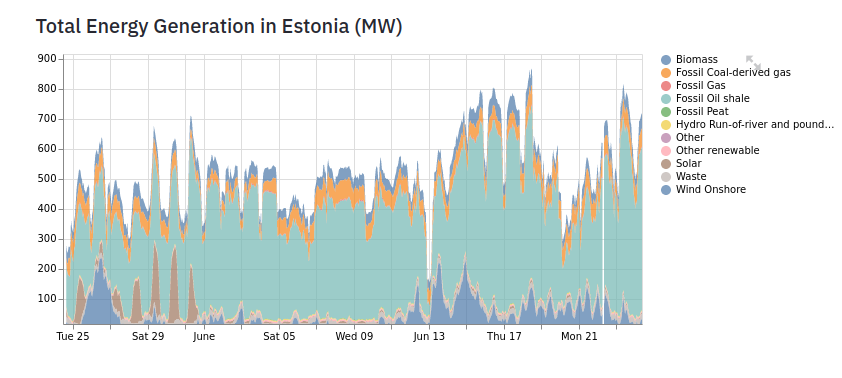

A web app that provides forecasts for renewable energy generation of EU countries, based on Streamlit and sktime. The app has been deployed on Heroku and is available [here](https://renewcastapp.herokuapp.com/) .

# Data API Access

To use the Python API, you need to complete the following three steps:

- Download and install the Python client for the ENTSO-E platform first. Link to the Github repository.
- Register on the ENTSO-E transparency platform: https://transparency.entsoe.eu/homepageLogin
- Request an API key by sending an email to transparency@entsoe.eu with “Restful API access” in the subject line. In the email body state your registered email address. You will receive an email when you have been provided with the API key. The key is then visible in your ENTSO-E account under “Web API Security Token”.

Once you have completed the above steps, you are ready to query data from the transparency platform with Python. It is quite handy if you want to do electricity market analysis as you get the data in tabular format and for a customizable time range. Below an example of the generation per power plant (in MW).

# Data Extraction

The get_energy_data() function interfaces with the ENTSOE-E API, to download the necessary data about energy generation for each EU country. Before defining the function, I inserted the @st.cache decorator to use the caching mechanism of Streamlit. I did that so the ENTSOE-E API will not be called every time we need to use that data, but only when it needs to be updated. This will optimize the performance of our app, and significantly reduce the time needed to run it. Let’s move on now, and examine the functionality of forecast.py , the last of the main source code files.

# SKTime

SKtime is a new and a great tool for time series analysis, it extends and the scikit-learn API to time series tasks. Main features of SKTime are:

- sktime comes with several forecasting algorithms (or forecasters), all of which share a common interface. The interface is fully interoperable with the scikit-learn interface, and provides dedicated interface points for forecasting in batch and rolling mode.
- sktime comes with rich composition functionality that allows to build complex pipelines easily, and connect easily with other parts of the open source ecosystem, such as scikit-learn and individual algorithm libraries.
- sktime is easy to extend, and comes with user friendly tools to facilitate implementing and testing your own forecasters and composition principles.

# Streamlit app

First of all, I imported the Streamlit library, as well as some functions I created myself. After that, I added a title and description for the app, using the associated Streamlit functions. I then proceeded to create a basic user interface, by adding widgets on the standard Streamlit sidebar. Users are able to select a country and regression algorithm, as well as modify the forecast horizon and the window length. Finally, I used the area_chart() and line_chart() functions to plot the total energy generation, as well as the forecasts of renewable energy generation (solar and wind). Let’s continue with the entsoe_client.py file.

# Model Selection

The select_regressor() function simply maps the regression algorithm options of the user interface, to the associated scikit-learn classes. I have included some typical scikit-learn regressions algorithms, such as Linear Regression, Random Forest and Gradient Boosting, but any regressor that is compatible with the scikit-learn API should work. The generate_forecast() function is responsible for the main functionality of the application, i.e. forecasting the future values of the energy generation time series. I accomplished that with the ReducedRegressionForecaster class, which applies the sliding window method to the time series, and then trains a regression model with that data, a technique that was discussed earlier. Finally, I also created the calculate_smape() function, which returns the symmetric mean absolute percentage error (SMAPE), a useful metric that can help us evaluate the accuracy of our forecast.

#  Run the app
To run the Streamlit app from a python script, run the following:

    import sys
    from streamlit import cli as stcli

    if __name__ == '__main__':
        sys.argv = ["streamlit", "run", "app.py"]
        sys.exit(stcli.main())
